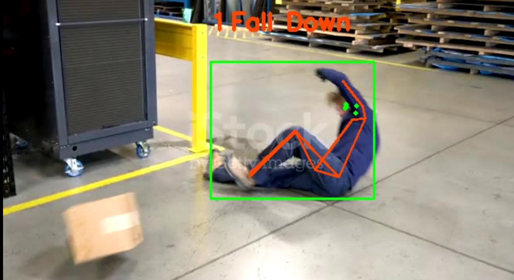
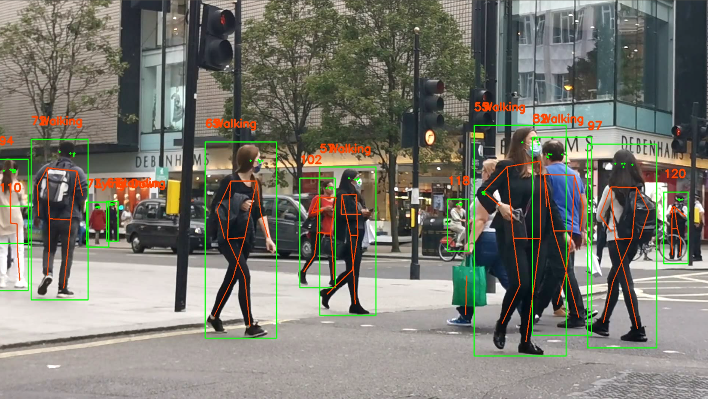

# Skeleton-Based-Action-Recognition

### Action recognition application [Skeleton-based Action Recognition]

* ⚡Inference Skeleton-based action recognition


****
## List of module

* Person keypoint detection: [Kapao](https://github.com/wmcnally/kapao) 
  - Convert to TensorRT
* Tracking: [SORT](https://github.com/abewley/sort) 
  - Save keypoints to person-track
* Skeleton-based action recognition: [ST-GCN](https://arxiv.org/pdf/1801.07455.pdf) 
  - Haven't converted to TensorRT because of some unsupported layers

****
## Install

### Requirements

* Python >= 3.6
* Pytorch >= 1.3

## Run

* Inference video

```bash
cd src
python main.py
```




## Reference

https://github.com/open-mmlab/mmskeleton

https://github.com/GajuuzZ/Human-Falling-Detect-Tracks


